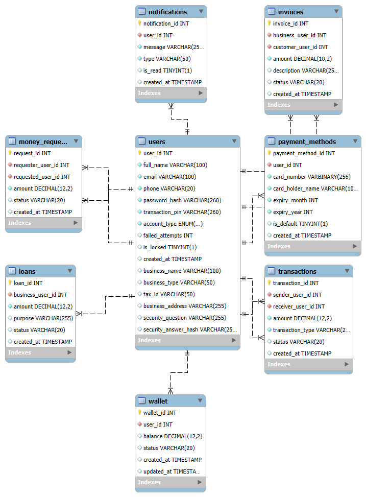

# 💳 RevPay – Digital Wallet & Payment System (Console Application)

RevPay is a **Java-based console application** that simulates a real-world **digital payment and wallet system**.  
It supports **personal and business users**, secure transactions, invoices, loans, analytics, and notifications.

This project is built using **Core Java + JDBC + MySQL**, following a **layered architecture** (Controller → Service → DAO).

---

## 🚀 Features

### 👤 User Management
- Personal & Business account registration
- Secure login (email / phone)
- Forgot password using **security questions**
- Change password & transaction PIN

### 💰 Wallet & Payments
- Wallet creation for every user
- Add money via payment methods
- Transfer money using transaction PIN
- View wallet balance

### 💳 Payment Methods
- Add card payment methods
- Validation for card number & expiry
- Default payment method support

### 🧾 Invoices (Business Users)
- Create invoices for customers
- View invoices
- Pay invoices
- Send invoice payment reminders

### 🤝 Money Requests
- Request money from other users
- View incoming money requests
- Accept or decline requests
- Auto money transfer on acceptance

### 🏦 Loans (Business Users)
- Apply for business loans
- Auto approval logic
- Repay loans from wallet
- View loan status

### 📊 Business Analytics
- Total revenue
- Outstanding invoices
- Approved & repaid loans
- Transaction count
- Top customers

### 🔔 Notifications
- Transaction notifications
- Invoice reminders
- Money request updates
- Read / unread notification tracking

---

## 🧱 Project Architecture
## Project Architecture

```text
RevPay
 └── src
     └── com.revpay
         │
         ├── app
         │   ├── RevPayApplication.java    # Application entry point
         │   └── MenuHandler.java          # Console navigation & menus
         │
         ├── controller
         │   ├── AuthController.java
         │   ├── WalletController.java
         │   ├── TransactionController.java
         │   ├── PaymentMethodController.java
         │   ├── InvoiceController.java
         │   ├── LoanController.java
         │   ├── MoneyRequestController.java
         │   ├── NotificationController.java
         │   ├── AnalyticsController.java
         │   └── BusinessAccountController.java
         │
         ├── service
         │   ├── AuthService.java
         │   ├── WalletService.java
         │   ├── TransactionService.java
         │   ├── PaymentMethodService.java
         │   ├── InvoiceService.java
         │   ├── LoanService.java
         │   ├── MoneyRequestService.java
         │   ├── NotificationService.java
         │   ├── AnalyticsService.java
         │   └── BusinessAccountService.java
         │
         ├── dao
         │   ├── UserDAO.java
         │   ├── WalletDAO.java
         │   ├── TransactionDAO.java
         │   ├── PaymentMethodDAO.java
         │   ├── InvoiceDAO.java
         │   ├── LoanDAO.java
         │   ├── MoneyRequestDAO.java
         │   ├── NotificationDAO.java
         │   └── AnalyticsDAO.java
         │
         ├── model
         │   ├── User.java
         │   ├── Wallet.java
         │   ├── Transaction.java
         │   ├── PaymentMethod.java
         │   ├── Invoice.java
         │   ├── Loan.java
         │   ├── MoneyRequest.java
         │   └── Notification.java
         │
         ├── security
         │   └── PasswordUtil.java         # Password & PIN hashing
         │
         ├── util
         │   ├── DBConnection.java         # JDBC connection utility
         │   ├── EncryptionUtil.java
         │   └── InputValidator.java
         │
         └── exception
             └── DuplicateUserException.java

```
---

## 🛠️ Tech Stack

- **Java**
- **JDBC**
- **MySQL**
- **Log4j2**
- **JUnit 5**
- **Eclipse IDE**

---

## 🔐 Security Measures

- Passwords stored using **hashing**
- Transaction PIN validation
- Security questions for password reset
- Input validation at service layer
- No sensitive data logged

---

## 🗄️ Database Setup

### Database Name
```bash
revpay_db
```


### Core Tables
- users
- wallets
- transactions
- invoices
- loans
- notifications
- money_requests
- payment_methods

## 🗺️ Database Design (ERD)

The following Entity Relationship Diagram (ERD) represents the database schema
used in the RevPay application, including users, wallets, transactions,
payment methods, invoices, loans, money requests, and notifications.




---

## ▶️ How to Run the Project (Step-by-Step)

### 1️⃣ Clone the Repository
```bash
git clone https://github.com/your-username/RevPay.git
```

### 2️⃣ Import into Eclipse

- Open **Eclipse**
- Go to **File → Import → Existing Java Project**
- Select the cloned project folder and click **Finish**

---

### 3️⃣ Configure MySQL

Update the database credentials in:

`com.revpay.util.DBConnection`

```java
private static final String URL = "jdbc:mysql://localhost:3306/revpay_db";
private static final String USER = "root";
private static final String PASSWORD = "your_password";
```

### 4️⃣ Add Required JARs

Add the following JAR files manually to the project’s **build path** (lib folder):

- `mysql-connector-j`
- `log4j-api`
- `log4j-core`
- `junit-jupiter` (for tests)

---

### 5️⃣ Run the Application

Run the main class:

`com.revpay.app.RevPayApplication`


---

## 🧪 Running JUnit Tests (Without Maven)

- Create test classes inside the `src` folder
- Right-click the test file → **Run As → JUnit Test**
- Green bar = Test passed ✅

### Example Test Classes
- `WalletServiceTest`
- `AuthServiceTest`


## 👨‍💻 Author

**Naveenkumar Deivasigamani**  
Computer Science Engineer | Backend Developer  
Java • JDBC • SQL

---

Developed by **Naveenkumar Deivasigamani** as a portfolio project showcasing secure software development practices and Java backend capabilities.


